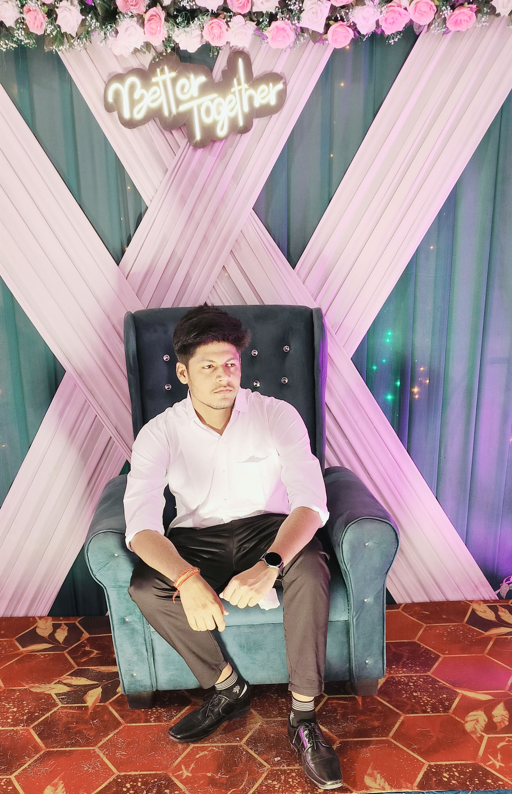

<!DOCTYPE html>
<html lang="en">
<head>
  <meta charset="UTF-8" />
  <meta name="viewport" content="width=device-width, initial-scale=1.0"/>
  <title>Aditya Raj | Portfolio</title>
  <link href="https://fonts.googleapis.com/css2?family=Poppins:wght@400;600&display=swap" rel="stylesheet">
  
</head>
<body>
  <header>
    
Aditya Raj

    <nav>
  <ul>
    <li><a href="#home" >Home</a></li>
    <li><a href="#about" >About Me</a></li>
    <li><a href="#skills" >Skills</a></li>
    <li><a href="#contact" >Contact</a></li>
  </ul>
</nav>

  </header>

  <!-- Home Section -->
  <section class="hero" id="home">
    

      

        

          
        

        

          
        

      

    

    <h1>Hi, It's Aditya Raj</h1>
    

      I'm a programmer of C++, C, Java, Python and also a web developer. B.Tech student 2nd year.
    

  </section>

  <!-- About Me Section -->
  <section class="about-section" id="about">
    

      
    

    

      <h1>About Me</h1>
      
Hello! I’m Aditya Raj, a passionate programmer proficient in C++, C, Java, Python, and web development. Currently a 2nd-year B.Tech student, I love building sleek and responsive web experiences that both look amazing and perform beautifully across devices.

      
When I’m not coding, I enjoy learning new tech, contributing to open-source, and exploring creative projects that push my skills further.

      

        
<strong>📍 Location:</strong> Patna, Bihar, India

        
<strong>📞 Phone:</strong> <a href="tel:+919876543210">+91 9876543210</a>

        
<strong>🐦 Twitter:</strong> <a href="https://twitter.com/yourhandle" target="_blank">@yourhandle</a>

      

    

  </section>
   
   
 
      >

  <!-- Skills Section -->
  <section class="skills-page" id="skills">
    <h1>My Skills</h1>
    
Here are some of the tools and technologies I excel at:

   

      
   

        

          <h2>Programming Languages</h2>
          
HTML

          
CSS

          
JavaScript

          
C++

        

   

          <h2>Tools & Frameworks</h2>
          
Git & GitHub

          
VS Code

          
React

        

      

      

        

          <h2>Soft Skills</h2>
          
Communication

          
Problem Solving

          
Teamwork

        

      

   

  </section>

  <footer class="site-footer" id="contact">
    
© 2025 Aditya Raj

  </footer>

</body>
</html>
